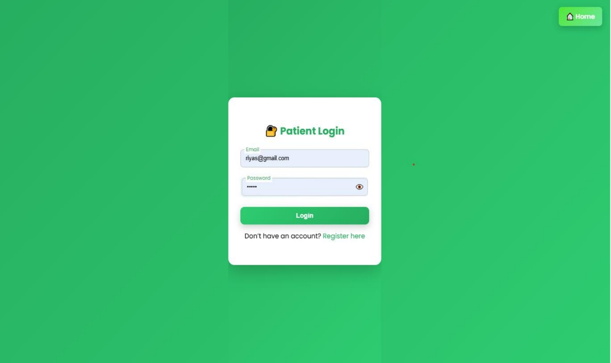
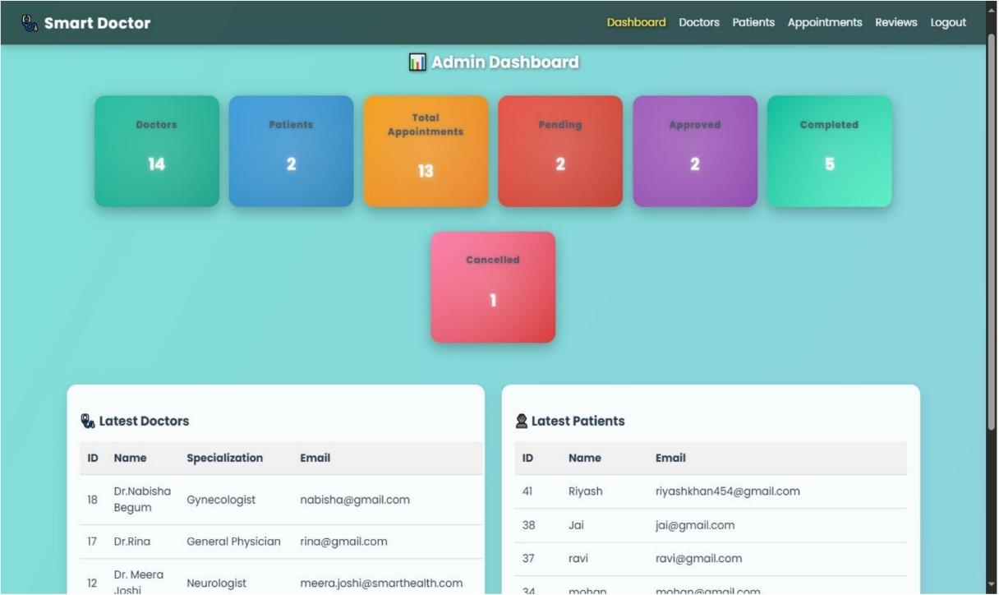
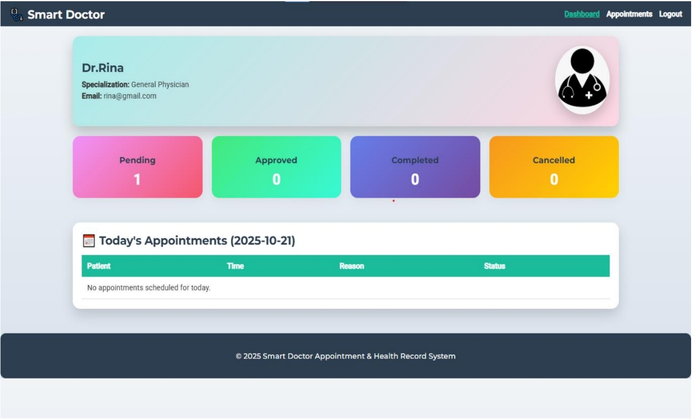
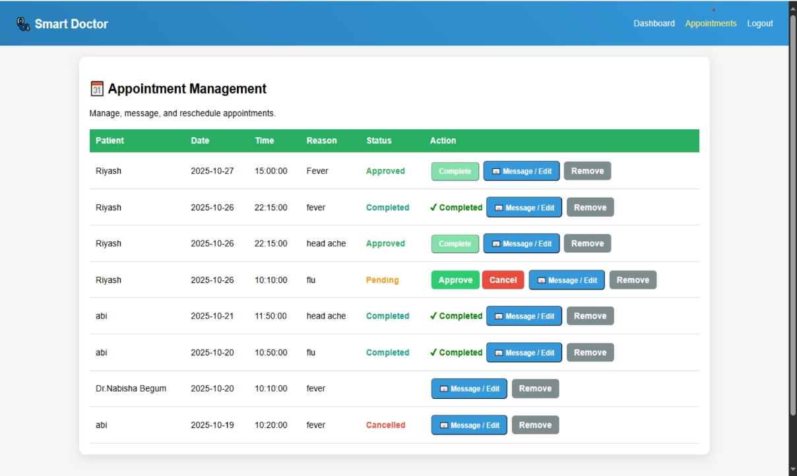
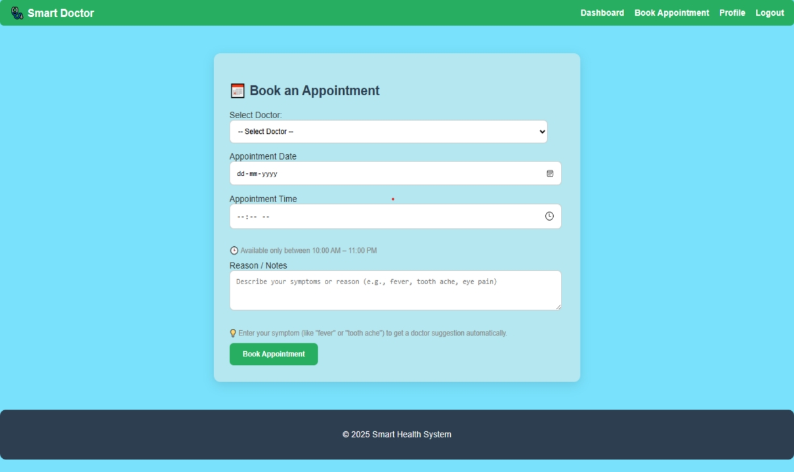

# Smart Health Management System

A full-featured Doctor Appointment and Health Record System built with **PHP + MySQL**.

## ✨ Features

- Admin Dashboard
- Doctor & Patient Management
- Appointment Booking & Management
- Email Notifications (PHPMailer)
- Patient Wallet System
- Reviews & Ratings

## 🛠 Tech Stack

- **Backend**: PHP 8, MySQL
- **Frontend**: HTML, CSS, JavaScript, Bootstrap
- **Email**: PHPMailer

## 🚀 How to Run

1. Clone the repo
2. Import `database.sql` into phpMyAdmin
3. Update database credentials in `config/db.php`
4. Start XAMPP and visit `http://localhost/doctor`

## 👤 Author
**Riyas Khan** - [GitHub](https://github.com/Riyashkhan2004)


# 🏥 Smart Doctor - Appointment & Health Record System

## 📌 Project Overview

Smart Doctor is a web-based healthcare management system that allows patients to book appointments, doctors to manage schedules, and admins to monitor the entire system.

## ✨ Features

- 👨‍⚕️ Doctor Management
- 🧑‍🤝‍🧑 Patient Management
- 📅 Online Appointment Booking
- 🔐 Secure Login System
- 📊 Admin Dashboard
- 👨‍⚕️ Doctor Dashboard
- 📋 Appointment Status Tracking
- 📝 Patient Records Management

---

# 📸 Screenshots

## 🏠 Home Page


---

## 🔐 Login Page



---

## 📊 Admin Dashboard



---

## 👨‍⚕️ Doctor Dashboard



---

## 📅 Appointment Management



---

## 📝 Book Appointment



---

## 🛠️ Technologies Used

- HTML
- CSS
- JavaScript
- PHP
- MySQL

---

## 🚀 Installation

1. Clone the repository

```bash
git clone your-repository-link
